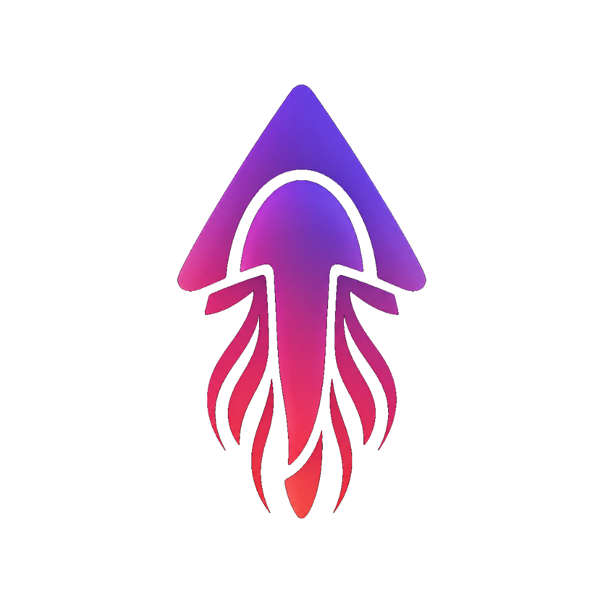

<p align="center">
  
</p>

<h1 align="center">Jellychat</h1>

<p align="center">
  <strong>A self-hosted, privacy-focused communication and collaboration platform built for Tailscale networks.</strong>
</p>

<p align="center">
  
  
  
  
</p>

## Overview
Jellychat is a comprehensive, self-hosted communication environment designed to operate over private Tailscale networks. It consolidates secure messaging, real-time collaborative development, group video conferencing, emulation, and localized AI integrations into a single platform. It is designed to run entirely on user-owned hardware without relying on external cloud providers.

## Core Features

### Real-Time Messaging & Media
- **Rich Media & Markdown:** Supports file uploads, inline images, and complete Markdown formatting.
- **Ephemeral Messaging:** Includes configurable self-destruct timers (30 seconds to 24 hours) for automatic message deletion across clients and servers.
- **End-to-End Encrypted DMs:** Direct 1-on-1 messaging is natively encrypted in the browser utilizing the Web Crypto API, ensuring server-side privacy.
- **P2P Large File Transfers:** Utilizes WebRTC Data Channels to transfer large files directly between clients, bypassing server storage.

### Collaborative Sandbox & AI Agent IDE
- **Multi-File Workspace:** Provides sandboxed environments for pair-programming. Features a file explorer for creating, switching, and deleting files, with state automatically persisted to the database.
- **Live Previewer & Terminal:** Includes an isolated iframe for native code rendering and a built-in console terminal for monitoring backend logs and execution outputs.
- **AI Auto-Injection:** Integrates an AI programming assistant that comprehends workspace context and automatically injects structural file modifications without requiring manual copy-pasting.
- **Responsive UI:** Features a mobile-optimized interface with collapsible panels and a floating AI module for efficient screen space utilization.

### Voice, Video & Streaming
- **WebRTC Voice Channels:** Supports real-time audio channels with Push-To-Talk (PTT) functionality and a Web Audio API visualizer.
- **Group Video & Screen Share:** Enables webcam sharing and direct screen broadcasting, including front/back camera toggling on mobile devices.
- **Native Fullscreen & Facepile:** Displays active participants via overlapping avatars and supports native fullscreen video playback on mobile.

### Advanced Integrations & Gaming
- **Built-in Arcade Emulator:** Integrates retro gaming capabilities via a `/roms` directory. Supports Netplay and automated cloud save states.
- **Live Whiteboarding:** Provides a synchronized, multiplayer canvas for real-time drawing and diagramming.
- **Local AI Integrations:** Supports local ComfyUI instances for image generation and Open WebUI integrations for localized LLM interactions (`@Jellybot`).
- **Game Server Browser:** Automatically detects and queries active game servers hosted on the local network.
- **Modpack Sync Hub:** Generates rich embeds with direct Steam Workshop subscription links (`steam://` protocol) from provided collection URLs.

### Admin & Network Management
- **Tailscale Guest Invites:** Facilitates the generation of time-limited Tailscale guest keys directly from the administrative UI.
- **Passwordless Profiles:** Assigns display names, avatars, and privileges based on device IP addresses.
- **Custom Statuses:** Allows users to set customizable presence states (Online, Idle, DND).

### Progressive Web App (PWA)
- Fully installable across mobile and desktop operating systems.
- Implements VAPID web-push subscriptions for background notifications (iOS compatible).
- Supports voice memos utilizing WaveSurfer.js for interactive audio waveforms.

---

## Setup Instructions

### Prerequisites
- [Node.js](https://nodejs.org/) (v18 or higher recommended)
- A configured [Tailscale](https://tailscale.com/) account and Tailnet
- *(Optional)* [ComfyUI](https://github.com/comfyanonymous/ComfyUI) (for AI image generation) and [Open WebUI](https://github.com/open-webui/open-webui) (for LLM integration)

### 1. Configuration
Create a `.env` file within the `backend` directory using the following parameters:

```env
# Server Port
PORT=3000

# Database Path
DB_PATH=./database.sqlite

# Tailscale settings for guest invites
TAILSCALE_API_KEY=your_tailscale_api_key_here
TAILSCALE_TAILNET=your_tailnet_name_here # e.g., yourname@github or tailnet-xyz.ts.net

# Optional AI Endpoints
COMFYUI_URL=http://your_comfyui_ip:8188
OPENWEBUI_URL=http://your_openwebui_ip:3000
OPENWEBUI_API_KEY=your_api_key_here
```

*(Note: If utilizing ComfyUI, place the `workflow.json` file in the backend directory.)*

### 2. Installation & Running
The application requires running both the backend server and the frontend client. VAPID keys for push notifications are generated automatically upon initial startup.

**Start the Backend:**
```bash
cd backend
npm install
npm start
```

**Start the Frontend:**
```bash
cd frontend
npm install
npm run dev
```

Navigate to the provided local IP address in a web browser on any device within the Tailnet. For optimal mobile experience, use the "Add to Home Screen" option in your mobile browser.
